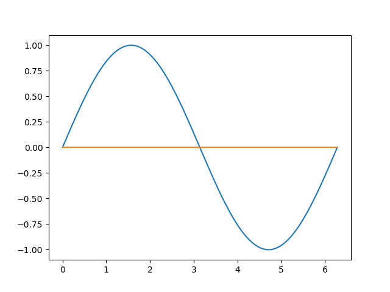

# TP1

Le script [src.py](google.com) prend en entrée une fonction f ainsi que les bornes d'un intervalle et le nombre de points à calculer sur cet intervalle, avant d'évaluer un polynôme de degré maximum n passant par ces points.

## 1. Paramétrage

Nous pouvons parametrer aisément le script en modifiant les valeurs des variables suivantes :

```py
# Choose a define function
f = np.sin

# Parameters to generate n points from f(x) for x in [a;b]
a = 0
b = 2*np.pi
n = 10
```

## 2. Génération des points

Le script génère ensuite les coordonnées des points P<sub>i</sub> (x<sub>i</sub>,y<sub>i</sub>) tels que y<sub>i</sub> = f(x<sub>i</sub>) pour i allant de 0 à n, avec x<sub>0</sub>=a et x<sub>n</sub>=b et les x<sub>i</sub> uniformément répartis sur cet intervalle.

```py
# Generate n points from f(x) for x in [a;b]
x = np.linspace(a,b,n)
y = f(x)
```

## 3. Résolution du système

Le script génère ensuite une [matrice de Vandermonde](https://fr.wikipedia.org/wiki/Matrice_de_Vandermonde) `v` avant de résoudre le système d'équation en A : V×A=Y, où V la matrice de Vandermonde, A le vecteur des coefficients du polynôme recherché et Y le vecteur contenant les y<sub>i</sub>

```py
# Generate Vandermonde matrix
v = np.vander(x, increasing=True)

# Generate coefficients matrix solving (S) = V.A=Y
a = np.linalg.solve(v,y)
```

## 4. Résultats

Le script génère ensuite les valeurs exactes et estimées d'un grand nombre de point, calcule l'erreur maximale sur l'estimation et affiche ensuite les deux courbes obtenues.

Les résultats suivant sont obtenus par interpolations de la fonction sinus par un polynôme de degré n :

* Pour n=1 :

<p align="center">

erreur maximale : 1
</p>

* Pour n=5 :

<p align="center">

erreur maximale : 0.1807581755118124
</p>

* Pour n=10 :

<p align="center">

erreur maximale : 0.00032749165197307195
</p>

On remarque alors que l'erreur maximale diminue sur l'intervalle de l'interpollation.