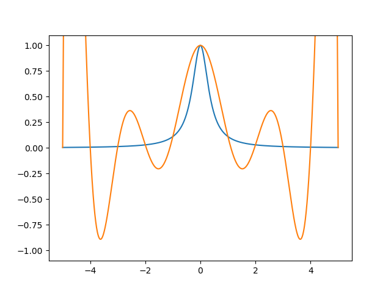
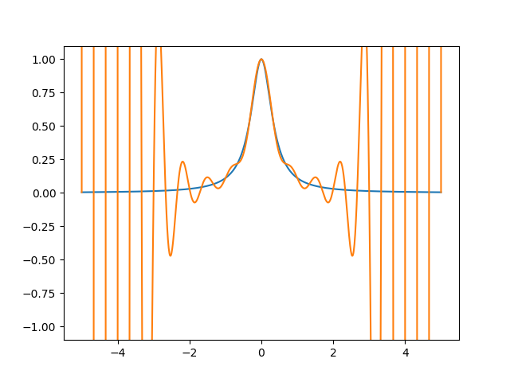
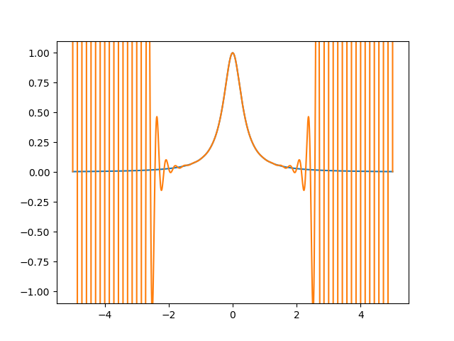

# TP2

Le script [src.py](https://github.com/LelayJ-ESIEE/4I/blob/master/Sciences_Ingenieur/SI1-Algebre_avance/TP2/src.py) prend en entrée une fonction f ainsi que les bornes d'un intervalle et le nombre de points à calculer sur cet intervalle, avant d'évaluer un polynôme de Lagrange de degré n passant par ces points.

## 1. Paramétrage

Nous pouvons parametrer aisément le script en modifiant les valeurs des variables suivantes :

```py
# Choose a define function
f = lambda x : 1/(1+8*x**2)

# Parameters to generate n points from f(x) for x in [a;b]
a = -5
b = 5
n = 11
```

## 2. Génération des points

Le script génère ensuite les coordonnées des points P<sub>i</sub> (x<sub>i</sub>,y<sub>i</sub>) tels que y<sub>i</sub> = f(x<sub>i</sub>) pour i allant de 0 à n, avec x<sub>0</sub>=a et x<sub>n</sub>=b et les x<sub>i</sub> uniformément répartis sur cet intervalle.

```py
# Generate n points from f(x) for x in [a;b]
X = np.linspace(a,b,n)
Y = f(X)
```

## 3. Génération de la base de Lagrance

Le script génère ensuite la base de Lagrange en `k` de `x`.

```py
# Compute Lagrange k base
def Lagrange(X, x, k):
    res = 1
    for i in range(n):
        if i != k:
            res *= (x-X[i])/(X[k]-X[i])
    return res
```

## 4. Résultats

Finalement, le script génère ensuite les valeurs exactes et estimées d'un grand nombre de point et affiche ensuite les deux courbes obtenues.

Les résultats suivant sont obtenus par interpolations de la fonction sinus par un polynôme de degré n :

* Pour n=11 :

<p align="center">

</p>

* Pour n=31 :

<p align="center">

</p>

* Pour n=71 :

<p align="center">

</p>

On remarque alors que l'erreur maximale diminue sur le centre de l'intervalle de l'interpollation, les erreurs aux extrémitées étant dues aux erreurs d'arrondi de la machine.