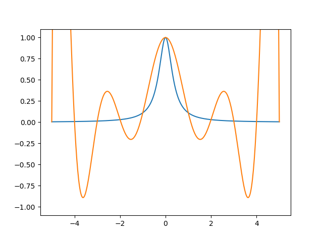
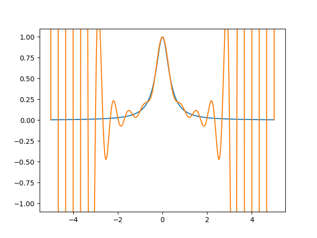
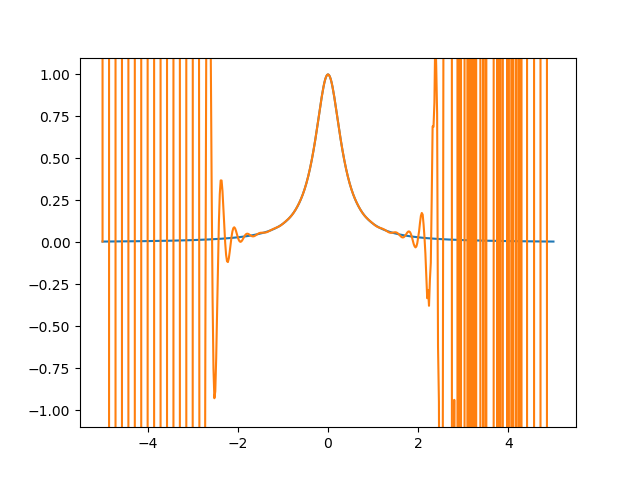

# TP3

Le script [src.py](https://github.com/LelayJ-ESIEE/4I/blob/master/Sciences_Ingenieur/SI1-Algebre_avance/TP3/src.py) prend en entrée une fonction f ainsi que les bornes d'un intervalle et le nombre de points à calculer sur cet intervalle, avant d'évaluer un polynôme de Newton de degré n-1 passant par ces points.

## 1. Paramétrage

Nous pouvons parametrer aisément le script en modifiant les valeurs des variables suivantes :

```py
# Choose a define function
f = lambda x : 1/(1+8*x**2)

# Parameters to generate n points from f(x) for x in [a;b]
a = -5
b = 5
n = 11
```

## 2. Génération des points

Le script génère ensuite les coordonnées des points P<sub>i</sub> (x<sub>i</sub>,y<sub>i</sub>) tels que y<sub>i</sub> = f(x<sub>i</sub>) pour i allant de 0 à n, avec x<sub>0</sub>=a et x<sub>n</sub>=b et les x<sub>i</sub> uniformément répartis sur cet intervalle.

```py
# Generate n points from f(x) for x in [a;b]
X = np.linspace(a,b,n)
Y = f(X)
```

## 3. Génération de la base de Newton

Le script génère ensuite la base de Newton en `k` de `x`.

```py
# Compute Newton k base
def Newton(X, k, x):
    N = 1
    for i in range(k):
        N *= (x-X[i])
    return N
```

## 4. Evaluation des différences divisées

Le script évalue par la suite les différences divisées dans une copie du vecteur `Y` :

```py
# Evaluate divided diff
def diff_divise(X, Y):
    yc = np.copy(Y)
    for ref in range(n-1):
        for k in range(ref+1, n):
            yc[k] = (yc[k]-yc[ref])/(X[k]-X[ref])
    return yc
```

## 5. Evaluation du polynôme de Newton et résultats

Finalement, le script évalue le polynôme de Newton et génère les valeurs exactes et estimées d'un grand nombre de point et affiche ensuite les deux courbes obtenues :

```py
# Evaluate Newton polynome
def polNewton(X, Y, x):
    yc = diff_divise(X,Y)
    s=0
    for k in range(n):
        s += yc[k]*Newton(X, k, x)
    return s


# Generate values
xaff = np.linspace(a,b,501)
yex = f(xaff)
yestim = polNewton(X, Y, xaff)

# Plot graphes
plt.ylim(-1.1, 1.1)
plt.plot(xaff,yex)
plt.plot(xaff,yestim)

plt.show()
```

Les résultats suivant sont obtenus par interpolations de la fonction f(x) = 1/(1+8*x**2) par un polynôme de degré n-1 :

* Pour n=11 :

<p align="center">

</p>

* Pour n=31 :

<p align="center">

</p>

* Pour n=71 :

<p align="center">

</p>

On remarque alors que, comme pour l'interpolation par un polynôme de Lagrange, l'erreur maximale diminue sur le centre de l'intervalle de l'interpollation, les erreurs aux extrémitées étant dues aux erreurs d'arrondi de la machine.

L'intérêt de cette méthode demeure cependant. Le cas échéant, l'ajout d'un point P<sub>k</sub> (x<sub>k</sub>,y<sub>k</sub>) à l'échantillon que nous avons ne requiert pas de recalculer intégralement le polynôme : il suffit de calculer la base de Newton en k en fonction de x, puis d'évaluer les différences divisées pour l'indice k et de réévaluer le polynôme.