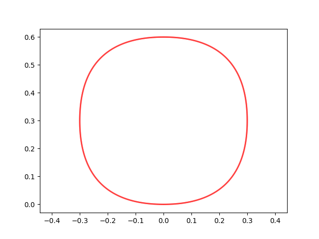

# <p align="center">TP4</p>

Le script [src.py](https://github.com/LelayJ-ESIEE/4I/blob/master/Sciences_Ingenieur/SI1-Algebre_avance/TP4/src.py) prend en entrée une liste de points afin de dessiner la courbe de Bezier paramétrée par ceux-ci.

## 1. Entrée

Nous pouvons d'abord paramétrer aisément le script en modifiant les valeurs dans la liste de points L :

```py
#########
#Entries#
#########

L = []
delta = 4.0/3.0 * math.tan(math.pi / 8) # For circle

# list of points (simple_draw)
# L = [(0,0), (1,1), (2,0)] # Conic
# L = [(0,0), (1,10), (3,-10), (4,0)] # Sin-like
# L = [(1,1), (0.5,0), (0,0), (0,1), (0.5,1), (1,0)] # Alpha
# L = [(-0.5,1), (1,0.5), (0,0), (-1,0.5), (0.5,1)] # Gamma
# L = [(0,2), (1,3), (2,2), (0,0)] # Half heart
# L = [(0, 2), (1, 2), (1, 0), (1, 0), (0, 0), (-1, 0), (-1, 0), (-1, 2), (0, 2)] # Egg
# L = [(0,0), (-0.3, 0), (-0.3, 0.3)] # Quarter of circle
# L = [(0,0), (-0.5, 0), (-0.5, 0.8), (0,0.8), (0.5, 0.8), (0.5, 0), (0,0)] # Approximated circle

# [...]

n = len(L)
N = 500
T = np.linspace(0, 1, N, endpoint=True)
debug = True # set to True to see control points
```

Certaines listes sont données à titre d'illustration.

## 2. Détermination des points de la courbe de Bezier

On évalue ensuite les positions des points de la courbe de Bezier, en s'appuyant sur des fonctions annexes permettant de calculer les coefficients binomiaux (k parmi n) et d'en déduire les coefficients de Bernstein associés au point.

```py
# Compute C(n,k) (k among n)
def binom(n, k):
    return ( math.factorial(n) / ( math.factorial(n-k) * math.factorial(k) ) )

# Evaluate berntein coefficient
def bernstein(n, i, t):
    return ( binom(n, i) * t**i * (1-t)**(n-i) )


# Evaluate Bezier curve points position
def bezier(L, N):
    points = []
    for k in range(N):
        S_x = 0
        S_y = 0

        for i in range(n):
            S_x += bernstein(n-1, i, T[k]) * L[i][0]
            S_y += bernstein(n-1, i, T[k]) * L[i][1]
        points.append((S_x, S_y))
    return points
```

## 3. Affichage des résultats

Il ne nous reste plus alors qu'à appeler appeler cette fonction et à afficher le résultat. Nous effectuons ces opérations dans la méthode `simple_draw` :

```py
# Plot result
def simple_draw():
    p = bezier(L, N)

    fig, ax = plt.subplots()
    if debug:
        l_lb = [[L[i], L[i+1]] for i in range(n - 1)]
        lb = mc.LineCollection(l_lb, colors="black", linewidths = 1)
        ax.add_collection(lb)

    l_cb = [[p[i], p[i+1]] for i in range(N - 1)]
    cb = mc.LineCollection(l_cb, colors="red", linewidths = 2)
    ax.add_collection(cb)

    ax.autoscale()

    plt.show()
```

## 4. Résultats

<br>

<p align="center">
<br>
Conic curve
</p><br>

<p align="center">
<br>
Sinus-like curve
</p><br>

<p align="center">
<br>
Alpha curve
</p><br>

<p align="center">
<br>
Gamma curve
</p><br>

<p align="center">
<br>
Half heart like curve
</p><br>

<p align="center">
<br>
Egg curve
</p><br>

<p align="center">
<br>
Quarter of circle curve
</p><br>

<p align="center">
<br>
Approximated circle
</p><br>

## 5. Et plus encore

La méthode `complex_draw` nous permet d'aller plus loin, en combinant plusieurs courbes de Bezier afin d'obtenir des formes plus complexes.

```py
# Plot result (multiple curves)
def complex_draw():
    global n
    fig, ax = plt.subplots()
    for l in L:
        n = len(l)
        p = bezier(l, N)
        sn = len(l)
        if debug:
            l_lb = [[l[i], l[i+1]] for i in range(sn - 1)]
            lb = mc.LineCollection(l_lb, colors="black", linewidths = 1)
            ax.add_collection(lb)

        l_cb = [[p[i], p[i+1]] for i in range(N - 1)]
        
        cb = mc.LineCollection(l_cb, colors="red", linewidths = 2)
        ax.add_collection(cb)

    ax.autoscale()
    ax.axis('equal')

    plt.show()
```

## 6. Résultats supplémentaires

<p align="center">
<br>
Heart-like curves
</p><br>

<p align="center">
<br>
Hypocycloid curve
</p><br>

<p align="center">
<br>
Approximated circle, 4 quarters
</p><br>

<p align="center">
<br>
Circle
</p><br>