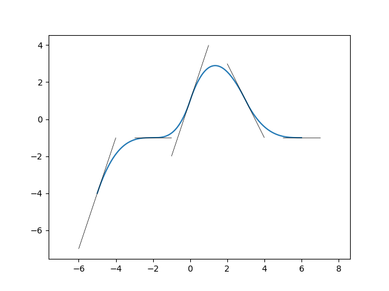

# <p align="center">TP5</p>

Le script [src.py](https://github.com/LelayJ-ESIEE/4I/blob/master/Sciences_Ingenieur/SI1-Algebre_avance/TP5/src.py) prend en entrée deux listes, respectivement d'abscisse et d'ordonnées de points, ainsi que la liste des dérivées en ces points. Il permet d'interpoler des polynômes de degré 3 passant par les points deux à deux et dont les dérivées en ces points correspondent aux dérivées passées en paramètre.

## 1. Entrée

Nous pouvons d'abord paramétrer aisément le script en modifiant les valeurs dans les listes suivantes :

```py
##########
#Entries #
##########

X = [-5, -2, 0, 3, 6]
Y = [-4, -1, 1, 1, -1]
V = [3, 0, 3, -2, 0]
n = 500
```

## 2. Détermination polynômes

On évalue ensuite les positions des points de la courbe, en s'appuyant sur les polynômes d'Hermites et les données connues :

```py
# Hermite's base
def phi0(t) :
    if (t >= 0 and t <= 1) :
        return (t-1)**2*(2*t+1)
    return 0

def phi1(t) :
    if (t >= 0 and t <= 1) :
        return t**2*(-2*t+3)
    return 0

def phi2(t) :
    if (t >= 0 and t <= 1) :
        return (t-1)**2*t
    return 0

def phi3(t) :
    if (t >= 0 and t <= 1) :
        return (t-1)*t**2
    return 0

# Compute Hermite's polynomes to get P(x)
def foncHermite(X, Y, V, x):
    S = 0
    for i in range(len(X)-1):
        di = X[i+1] - X[i]
        t = (x - X[i]) / di
        S += (Y[i] * phi0(t) + Y[i+1] * phi1(t) + di * (V[i] * phi2(t) + V[i+1] * phi3(t)))
    return S
```

## 3. Affichage des résultats

Il ne nous reste plus alors qu'à appeler appeler cette dernière fonction et à afficher le résultat :

```py
if __name__ == "__main__":
    x = np.linspace(X[0], X[len(X)-1], n)
    y = []
    for i in range(n):
        y.append(foncHermite(X, Y, V, x[i]))

    fig, ax = plt.subplots()
    ax.plot(x,y)

    l_t = [[(X[i]-1, Y[i]-V[i]), (X[i]+1, Y[i]+V[i])] for i in range(len(X))]
    t = mc.LineCollection(l_t, colors="black", linewidths = 0.5)
    ax.add_collection(t)

    ax.autoscale()
    ax.axis('equal')
    plt.show()
```

## 4. Résultats

<br>

<p align="center">
<br>
Courbe résultant de l'interpolation d'Hermite de la grille suivante :
</p>

| x | y | v |
|:-:|:-:|:-:|
| -5| -4|  3|
| -2| -1|  0|
|  0|  1|  3|
|  3|  1| -2|
|  6| -1|  0|

