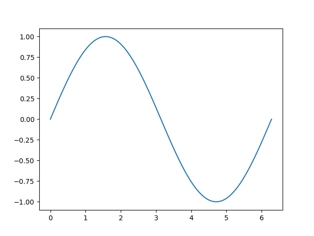
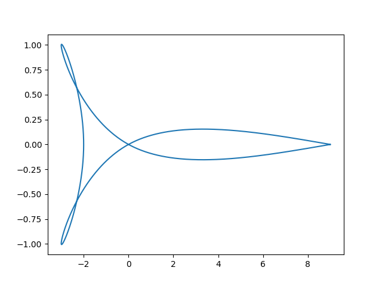
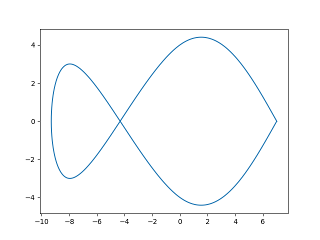

# <p align="center">TP6</p>

Le script [src.py](https://github.com/LelayJ-ESIEE/4I/blob/master/Sciences_Ingenieur/SI1-Algebre_avance/TP6/src.py) a deux modes de fonctionnement : par passage d'une fonction et par passage de listes de coordonnées en paramètre.

## 1. Entrée et mode de fonctionnement

Nous pouvons d'abord paramétrer aisément le script en modifiant les valeurs dans le main, ainsi que sélectionner le mode de fonctionnement en commentant la ligne non-désirée :

```py
##########
#Entries #
##########

# For main_func
n = ...
a = ...
b = ...
f = ...

# (example for sin)
# n = 500
# a = 0
# b = 2*np.pi
# f = np.sin

# For main_param
X = ...
Y = ...

# Example : Fusée
# X = [9,0,-3,-2,-3,0,9]
# Y = [0,0,-1,0,1,0,0]

# Example : Poisson
# X = [7,0,-8,-8,0,7]
# Y = [0,4,-3,3,-4,0]

##########
# Modes  #
##########

main_func(a, b, n, f)
main_param(X, Y)
```

## 2. Fonctions utilitaires

Nous réutilisons dans ce script les fonctions utilisées pour l'interpolation d'Hermite, en plus d'une fonction remplissant et retournant la matrice à sous- et sur-diagonale et d'une autre calculant le vecteur Z :

Z = 3/d * {y1-y0, y2-y0, ... yk+1 - yk-1... yn - yn-1}

```py
##########
# Script #
##########

# Hermite's base
def phi0(t) :
    if (t >= 0 and t <= 1) :
        return (t-1)**2*(2*t+1)
    return 0

def phi1(t) :
    if (t >= 0 and t <= 1) :
        return t**2*(-2*t+3)
    return 0

def phi2(t) :
    if (t >= 0 and t <= 1) :
        return (t-1)**2*t
    return 0

def phi3(t) :
    if (t >= 0 and t <= 1) :
        return (t-1)*t**2
    return 0

# Compute matrix
def matrice(n):
    M = np.zeros((n,n))
    for i in range(n-1):
        M[i][i] = 4
        M[i+1][i] = 1
        M[i][i+1] = 1
    M[0][0] = 2
    M[-1][-1] = 2
    return M

# Compute Z vector where Z = 3/d * {y1-y0, y2-y0, ... yk+1 - yk-1... yn - yn-1}
def VectZ(Y, d):
    n = len(Y)
    v = [Y[1]-Y[0]]
    for i in range(1, len(Y)-1):
        v.append(Y[i+1]-Y[i-1])
    v.append(Y[n-1]-Y[n-2])
    Z = [3/d * t for t in v]
    return Z

# Compute Hermite's polynomes to get P(x)
def foncHermite(X, Y, V, x):
    S = 0
    for i in range(len(X)-1):
        di = X[i+1] - X[i]
        t = (x - X[i]) / di
        S += (Y[i] * phi0(t) + Y[i+1] * phi1(t) + di * (V[i] * phi2(t) + V[i+1] * phi3(t)))
    return S
```

## 3. Mode fonction

Le mode fonction prend donc en entrée les bornes de l'intervalle d'interpolation, la fonction à interpoler ainsi que le nombre de points sur lesquels se baser. Elle génère d'abord les n points avant de calculer le vecteur Z et la matrice définis plus haut et de résoudre l'équation matricielle en Yp : M * Yp = Z, où Yp le vecteur des dérivées aux points calculés. Il ne nous reste plus qu'à interpoler la courbe à l'aide de l'interpolation d'Hermite et à afficher les courbes interpolées. 

```py
def main_func(a, b, n, f):
    # Generate n points from f(x) for x in [a;b]
    X = np.linspace(a,b,n)
    Y = f(X)

    d = (b-a)/n
    Z = VectZ(Y, n)

    M = matrice(n)

    Yp = np.linalg.solve(M, Z)
    x_aff = np.linspace(a, b, 1000)
    y_est = []
    for i in range(len(x_aff)):
        y_est.append(foncHermite(X, Y, Yp, x_aff[i]))

    plt.plot(x_aff, y_est)
    plt.show()
```

## 4. Mode liste

Le mode liste suit le même cours, à ceci près qu'il réalise l'opération sur les deux listes de coordonnées fournies, utilisant les index des coordonnées pour abscisse (d'où d = 1).

```py
def main_param(X,Y):
    n = len(X)
    T = range(1,n+1)

    d = 1

    Zx = VectZ(X, d)
    Zy = VectZ(Y, d)

    M = matrice(n)

    Ypx = np.linalg.solve(M, Zx)
    Ypy = np.linalg.solve(M, Zy)

    Taff = linspace(1, n-0.001, 1000)
    Xaff = [foncHermite(T, X, Ypx, x) for x in Taff]
    Yaff = [foncHermite(T, Y, Ypy, x) for x in Taff]

    plt.plot(Xaff,Yaff)
    plt.show()
```

## 5. Résultats

<br>

<p align="center">
<br>
Courbe résultant de la fonction sinus entre 0 et 2*pi
</p>

<br>

<p align="center">
<br>
Courbe résultant de la grille suivante :
</p>

| x | y |
|:-:|:-:|
|  9|  0|
|  0|  0|
| -3| -1|
| -2|  0|
| -3|  1|
|  0|  0|
|  9|  0|

<br>

<p align="center">
<br>
Courbe résultant de la grille suivante :
</p>

| x | y |
|:-:|:-:|
|  7|  0|
|  0|  4|
| -8| -3|
| -8|  3|
|  0| -4|
|  7|  0|